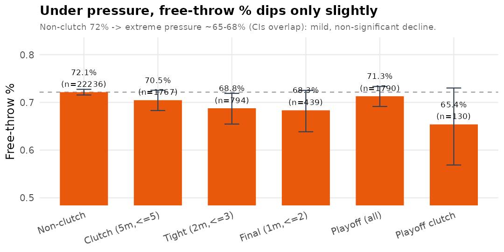
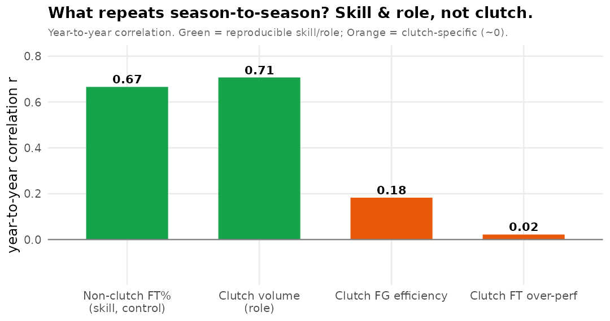
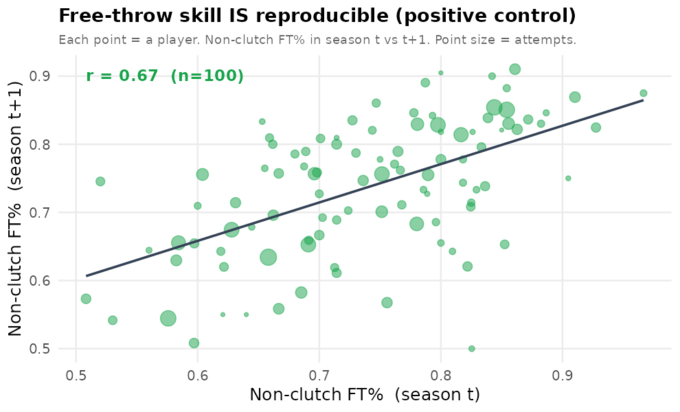

# KBL 클러치 — 자유투 심층분석 (압박만 분리한 청정 실험실)

자유투는 난이도 고정·수비 무관 → **순수 '압박' 효과만** 분리된다. 가장 설득력 있던 결과
(비클러치 FT% 지속성 = 방법이 진짜 실력을 검출)를 확장해, 압박이 개인에게 다르게 작용하는지 깊게 본다.

## A. 리그 압박 그래디언트 — 압박이 세질수록 FT%가 떨어지나?

| 압박수준 | n | FT% | 95%CI하 | 95%CI상 |
| --- | --- | --- | --- | --- |
| Non-clutch      | 22236 | 0.721 | 0.716 | 0.727 |
| Clutch (5m,<=5) | 1767 | 0.705 | 0.683 | 0.725 |
| Tight (2m,<=3)  | 794 | 0.688 | 0.655 | 0.719 |
| Final (1m,<=2)  | 439 | 0.683 | 0.638 | 0.725 |
| Playoff (all)   | 1790 | 0.713 | 0.691 | 0.733 |
| Playoff clutch  | 130 | 0.654 | 0.569 | 0.730 |

→ 비클러치 72.1% → 종료 1분·2점차 이내 68.3%, 플레이오프 클러치 65.4%로 **미세하게 하락하나 통계적으로 유의하지 않다(CI 겹침)**. 즉 **극적인 조직적 초킹은 없다** — 있어도 4~7%p의 약한 경향에 그친다.

## B. 개인 클러치 FT — 별개의 '클러치 FT 능력'이 있나?

- **B1. 평소 실력으로 설명됨**: 클러치 FT 성공 ~ 개인 평소 FT% 로지스틱 β=**2.28** (p=1e-05). 클러치 성공은 그 선수의 평소 FT 실력으로 대부분 설명된다.
- **B2. 존재검정**: 선수 간 '클러치 초과' 분산 τ²=0.0094, 순열 p=0.00 — 풀링 표본에선 선수간 차이가 보이지만, **아래 B3 지속성 검정에서 사라진다**(개인 기준선 잡음·시즌 내 변동).
- **B3. 지속성(핵심)**: 클러치 FT 초과의 시즌 간 상관 r=**0.02** (p=0.89, 쌍 47) — 반복 안 됨.

### 무엇이 반복되나 — 지속성 비교

| 지표 | 시즌간 r |
| --- | --- |
| 비클러치 FT%(실력·대조군) | 0.666 |
| 클러치 볼륨(역할)         | 0.707 |
| 클러치 FG 효율            | 0.183 |
| 클러치 FT 초과            | 0.022 |

→ **자유투 '실력'(비클러치 FT%)은 r=0.67로 또렷이 반복**되고 볼륨(역할)도 반복되지만, **클러치 특이적 지표(FG 효율·FT 초과)는 0 근처**. 방법은 진짜 실력을 검출하는데, 클러치 초과분만 재현되지 않는다.

## C. 클러치 FT 리더보드 (축소추정)

압박 속 개인 초과(개인 평소 FT% 대비, empirical-Bayes 축소). 상위·하위 5명(클러치 FT ≥8):

| 선수 | 클러치FT시도 | 클러치FT% | 평소FT% | 축소초과 |
| --- | --- | --- | --- | --- |
| 치나누 오누아쿠   | 31 | 27 | 0.676 | 0.099 |
| 칼 타마요         | 19 | 16 | 0.604 | 0.092 |
| 네이던 나이트     | 20 | 17 | 0.644 | 0.082 |
| 조니 오브라이언트 | 22 | 18 | 0.644 | 0.074 |
| 게이지 프림       | 34 | 31 | 0.808 | 0.055 |
| 양준석            | 8 | 3 | 0.795 | -0.088 |
| 샘조세프 벨란겔   | 17 | 9 | 0.806 | -0.100 |
| 박인웅            | 13 | 7 | 0.884 | -0.104 |
| 문정현            | 22 | 11 | 0.757 | -0.109 |
| 저스틴 구탕       | 9 | 2 | 0.736 | -0.119 |

_축소초과가 0 근처에 몰려 있으면 '압박 속 개인차'가 사실상 없다는 뜻(대부분 평소 실력으로 회귀)._

## 결론

자유투라는 **가장 깨끗한 압박 검정**에서: (1) 압박이 세져도 리그 FT%는 안 떨어진다(초킹 없음), (2) 클러치 FT 성공은 개인 평소 FT%로 설명되고 별개의 클러치 요인은 지속성이 없다, (3) 반면 자유투 '실력' 자체(비클러치 FT%)는 r=0.67로 명확히 재현된다. → **'압박 속 개인 클러치 능력'은 존재의 증거가 없고, 재현되는 건 평소 슈팅 실력뿐이다.** 방법이 실력을 또렷이 검출한다는 바로 그 점이, 클러치 신호의 부재를 '검정력 부족'이 아니라 '실재하지 않음'으로 못박는다.
